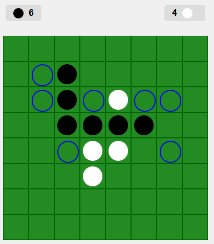

# Othello Reversi Game

This project is a web-based implementation of the classic board game **Othello (Reversi)**. It features a Spring Boot backend with REST endpoints and a simple HTML/CSS/JavaScript frontend. The game supports both **Player vs. Computer** and **Player vs. Player** .

<p align="center">
  
</p>


## Features

- **Game Setup:** Create or join a game session using the provided menu.
- **Valid Moves Highlighting:** The frontend calls a backend endpoint to fetch and highlight valid moves.
- **Turn Management:** The backend automatically passes the turn when no valid moves exist.
- **Websockets & State Updates:** The server and client communicate via Websockets for updated game state for multiplayer scenarios.
- **Extensible Design:** Built to easily support future enhancements.

## Technologies

- **Backend:** Spring Boot, Java , Websockets
- **Frontend:** HTML, CSS, and vanilla JavaScript
- **Build Tool:** Maven

## Getting Started

### Prerequisites

- Java 11 or higher
- Maven
- A modern web browser (Chrome, Firefox, etc.)

### Running the Backend

1. Clone the repository.
2. Navigate to the project directory.
3. Build the project with Maven:
```bash
  mvn clean install
```
4. Run the application :
```bash
  mvn spring-boot:run
```
The backend will start on http://localhost:8080. 

### Running the Frontend
Once the backend is running, open your browser and navigate to:
```bash
http://localhost:8080/index.html

```
