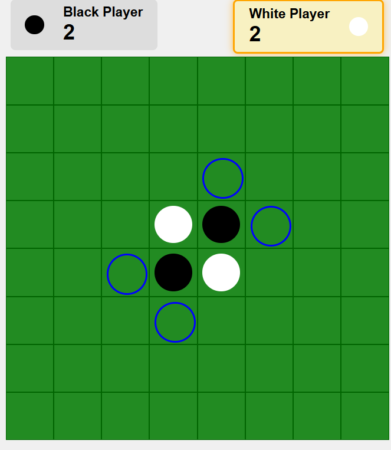

# Othello Reversi Game

This project is a web-based implementation of the classic board game **Othello (Reversi)**. It features a Spring Boot backend with REST endpoints and a simple HTML/CSS/JavaScript frontend. The game supports **Player vs. Computer**, **Player vs. Player**, and real-time **Matchmaking** for quick pairing.

<p align="center">
  
</p>


## Features

- **Game Modes:** Player vs Player, Player vs Computer, and matchmaking.
- **Leaderboard:** Global rankings with wins, losses, and win rate.
- **Authentication:** Login for personal stats.
- **Move Hints:** Highlights legal moves.
- **Realtime Updates:** WebSocket game state updates.

## Technologies

- **Backend:** Spring Boot, Java , Websockets
- **Security:** Spring Security
- **Frontend:** HTML, CSS, and vanilla JavaScript
- **Build Tool:** Maven

## Getting Started

### Prerequisites

- Java 17 or higher
- Maven
- A modern web browser (Chrome, Firefox, etc.)

### Running the Backend

1. Clone the repository.
2. Navigate to the project directory.
3. Build the project with Maven:
```bash
  mvn clean install
```
4. Run the application :
```bash
  mvn spring-boot:run
```
The backend will start on http://localhost:8080. 

### Running the Frontend
Once the backend is running, open your browser and navigate to:
```bash
http://localhost:8080/index.html

```

### Optional: Run with PostgreSQL

1. Start a PostgreSQL instance (example Docker compose):
   ```bash
   docker run --name othello-postgres -e POSTGRES_DB=othello -e POSTGRES_USER=othello -e POSTGRES_PASSWORD=othello -p 5432:5432 -d postgres:15
   ```
2. Launch the application with the `postgres` profile so Spring uses `application-postgres.properties`:
   ```bash
   mvn spring-boot:run -Dspring-boot.run.profiles=postgres
   ```
3. The schema is created automatically (hibernate `ddl-auto=update`). Data persists across restarts.

## How to Play

- **Player vs Computer:** Choose *New Game* → *Player vs Computer* to start immediately as White against the AI.
- **Player vs Player (Manual):** Choose *New Game* → *Player vs Player*. Share the displayed Session ID with a friend; they can join via *Join Game* using that ID.
- **Matchmaking:** Click *Find Match*, optionally set a nickname and preferred color, and wait to be paired. When a match is found, both players are redirected into the game automatically.
